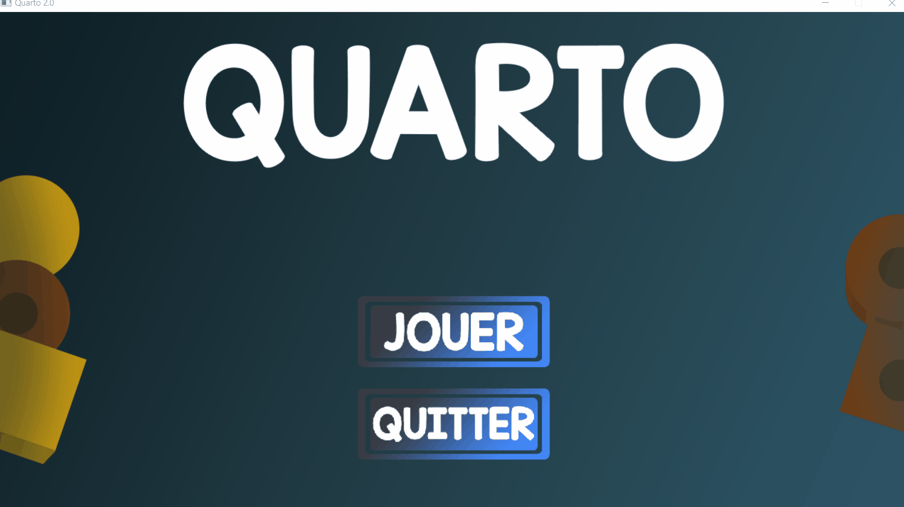

# Quarto

Création du jeu de Quarto en C++ avec la bibliothèque graphique SDL2

Vidéo présentation du jeu :


## Principe du jeu
+ Deux joueurs s'affronte sur un plateau de 16 cases, et disposent de 16 pions
+ Chaque pion est unique et caractérisé par 4 aspects : Clair ou foncé, haut ou bas, rond ou carré, et troué ou non troué.
+ A chaque tour, un joueur va désigner quel pion va devoir poser son adversaire
+ Un joueur gagne la partie quand il pose 4 pions réunissant 4 fois la même caractérique en ligne, en colonne ou en diagonale (exemple en vidéo ou le joueur pose 4 pions petits)

## Comment lancer le jeu ? (Windows et Linux)
+ Une fois le dossier téléchargé il vous faudra g++ d'installé pour compiler le projet
+ De là on utilise le Makefile avec la commande ```make``` à la base du projet
+ Puis on exécute le programme avec ```.\bin\quarto2.exe ```
